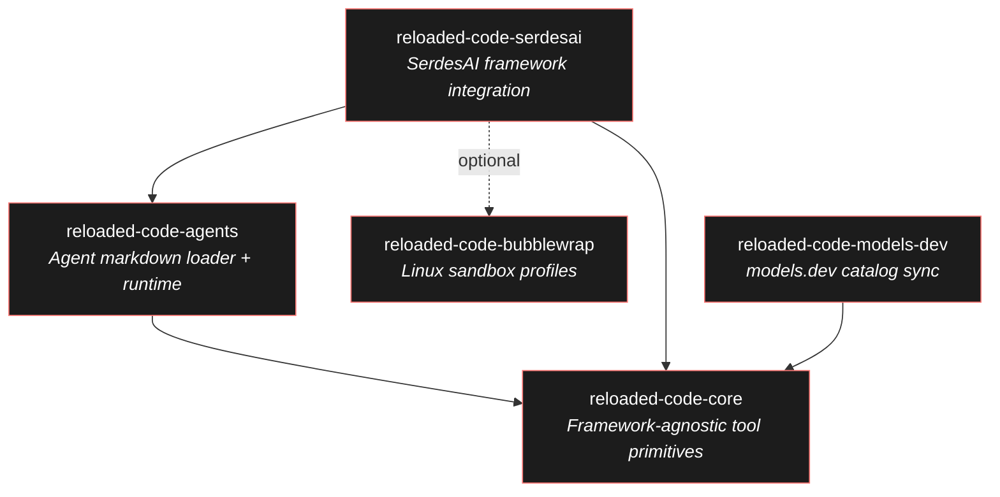
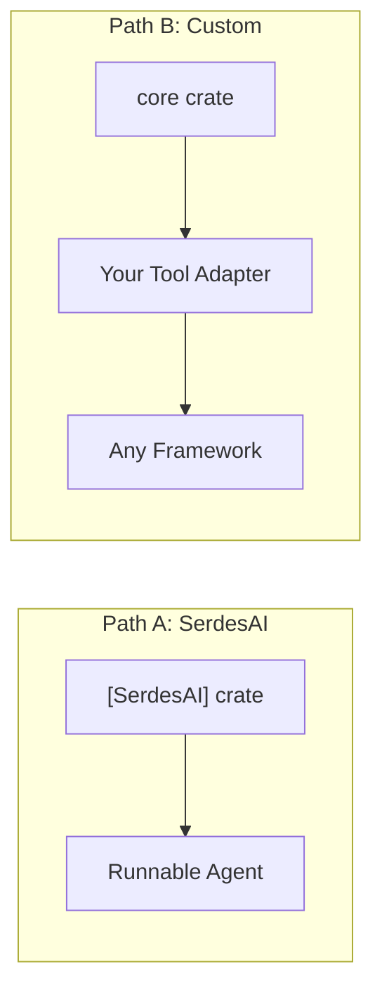

# Architecture

reloaded-code is a Rust workspace with 5 crates that layer on top of each
other. This page explains how they connect and where your code plugs in.

## Crate dependency graph

## Layer overview

### reloaded-code-core

The foundation. Contains every tool implementation as a plain function
(`read_file`, `write_file`, `edit_file`, etc.), plus supporting types:

- **Path resolvers** - control which files tools can access
- **System prompt builder** - generates context-aware tool guidance
- **Permission engine** - last-match-wins rules with wildcard patterns
- **Credential resolver** - API key lookup with override support ([details](getting-started.md#credential-management))
- **Model catalog** - compact hash-table-based provider/model lookup

Core is **framework-agnostic**: it has no dependencies on any specific LLM
framework. Your integration layer wraps these functions into framework-specific
tool types.

### reloaded-code-agents

Loads agent definitions from markdown files with YAML frontmatter. Provides:

- **AgentLoader** - scans directories for `.md` agent files
- **AgentCatalog** - name-to-config lookup table
- **AgentRuntime** - bundles catalog + defaults + permissions + task settings

The agent file format mirrors [OpenCode]'s schema - similar enough that many
files are drop-in compatible, but [not identical](migration.md). The most
notable difference is **default-deny** permissions: tools must be explicitly
allowed.

### reloaded-code-serdesai

The ready-to-use integration layer for the [SerdesAI] framework. It:

- Wraps core tool functions into [SerdesAI] `Tool` trait implementations
- Bridges 15 provider types to concrete [SerdesAI] model constructors
- Builds runnable `Agent` instances from agent markdown definitions
- Handles multi-agent task delegation with depth limits

If you use [SerdesAI], this is the only crate you need. If you use a different
framework, build your own adapters using core.

### reloaded-code-bubblewrap

Linux-only. Builds and manages [bubblewrap] sandbox profiles for shell command
isolation. Two presets:

- **Public Bot** - for untrusted input (no network, minimal filesystem)
- **Trusted Maintenance** - for trusted automation (read-only host `/`, network on)

### reloaded-code-models-dev

Syncs the online [models.dev](https://models.dev) catalog into a compact
`ModelCatalog`. Features:

- ETag-based conditional HTTP requests
- [zstd]-compressed cache (~24 KiB for ~3000 models)
- Offline fallback when network is unavailable
- Cache load in ~0.3 ms

## Where your code plugs in

There are two integration paths:

**Path A: Use [SerdesAI]** - Add `reloaded-code-serdesai`, attach tools to an
`AgentBuilder`, and run. This is the fastest path to a working agent.

**Path B: Bring your own framework** - Depend on `reloaded-code-core`,
implement your framework's tool trait by calling the core functions, and use
`SystemPromptBuilder` to generate the system prompt. See
[Custom Framework](guides/custom-framework.md) for a walkthrough.

[SerdesAI]: https://crates.io/crates/serdes-ai
[OpenCode]: https://opencode.ai/
[bubblewrap]: https://github.com/containers/bubblewrap
[zstd]: https://facebook.github.io/zstd/
