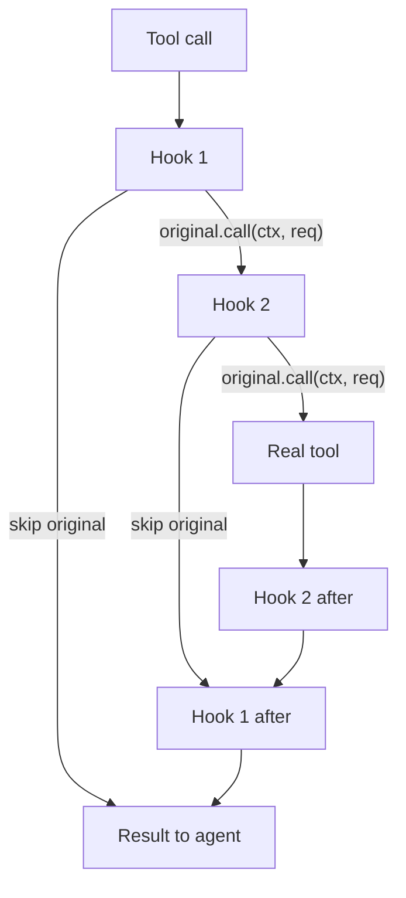

# Hooks

Hooks let your code see, change, or stop things the agent does.

!!! warning "Work in progress"
    Backend wiring is not done yet. Core hooks, event types, and container
    exist. [SerdesAI] dispatch code comes next.

Tool hooks work like game mods.
Each hook gets an `original` function.
`original` calls the next hook or the real tool.

This lets you run code before and after the tool call in the same method.

## Example

A hook can modify the request before the tool sees it.

`$HOME` in string arguments expands to the user's home directory:

```rust
use std::env;
use serde_json::Value;
use reloaded_code_core::{
    HookSet, ToolCallContext, ToolHook, ToolHookFuture, ToolOriginal,
    ToolOutput, ToolRequest,
};

struct HomeExpander;

impl ToolHook for HomeExpander {
    fn hook<'a>(
        &'a self,
        ctx: &'a ToolCallContext<'a>,
        mut req: ToolRequest,
        original: ToolOriginal<'a>,
    ) -> ToolHookFuture<'a> {
        Box::pin(async move {
            // Expand $HOME → real home directory in all string args
            if let Some(home) = env::var("HOME").ok() {
                if let Some(map) = req.args.as_object_mut() {
                    for val in map.values_mut() {
                        if let Value::String(s) = val {
                            *s = s.replace("$HOME", &home);
                        }
                    }
                }
            }

            original.call(ctx, req).await
        })
    }
}

let hooks = HookSet::builder()
    .tool_hook(HomeExpander)
    .build();
```

To block or replace a tool call, do not call `original`.

A common case: prevent credential leaks by blocking read/write access
to `.env` files.

```rust
use reloaded_code_core::{
    HookSet, ToolCallContext, ToolHook, ToolHookFuture, ToolOriginal,
    ToolOutput, ToolRequest,
};

struct EnvFileGuard;

impl ToolHook for EnvFileGuard {
    fn hook<'a>(
        &'a self,
        ctx: &'a ToolCallContext<'a>,
        req: ToolRequest,
        original: ToolOriginal<'a>,
    ) -> ToolHookFuture<'a> {
        Box::pin(async move {
            // Block access to .env files
            if let Some(path) = req.args.get("path").and_then(|v| v.as_str()) {
                if path.starts_with(".env") || path.contains("/.env") {
                    return Ok(ToolOutput::new(
                        "Blocked: .env files contain secrets"
                    ));
                }
            }

            // All other calls pass through
            original.call(ctx, req).await
        })
    }
}

let hooks = HookSet::builder()
    .tool_hook(EnvFileGuard)
    .build();
```

## Available types

### Tool hook types

| Type                | Purpose                                                    |
| ------------------- | ---------------------------------------------------------- |
| [`ToolHook`]        | Intercepts a tool call and may call [`ToolOriginal`].      |
| [`ToolOriginal`]    | Pointer to next hook or the real tool.                     |
| [`ToolHookFuture`]  | Boxed future returned by tool hooks.                       |
| [`ToolCallContext`] | Tool name, agent name, run id.                             |
| [`ToolRequest`]     | JSON arguments carried through the hook chain.             |
| [`ToolOutput`]      | Tool call result wrapping content and truncation metadata. |

### Container types

| Type               | Purpose                               |
| ------------------ | ------------------------------------- |
| [`HookSet`]        | Stores tool hooks and session events. |
| [`HookSetBuilder`] | Builder for [`HookSet`].              |

## How tool hooks stack

This diagram assumes you register two hooks. If you set no hooks, the
tool call goes straight to the real tool (fast path).

Tool hooks run in registration order. Each hook receives an `original`
function. That function calls the next hook or the real tool.


This works like game mods.
Your hook gets a function.
That function is `original`.
It calls the next hook, not always the real tool.

## Getting started

Build a `HookSet` with your hooks, then pass it to the runtime:

```rust
use reloaded_code_agents::AgentRuntimeBuilder;
use reloaded_code_core::HookSet;

let hooks = HookSet::builder()
    .tool_hook(EnvFileGuard)
    .build();

let runtime = AgentRuntimeBuilder::new()
    .hooks(hooks)
    .build()?;

assert!(!runtime.hooks().is_empty());
```

Calling `.hooks(set)` replaces any existing `HookSet`. Omitting it
passes `HookSet::default()`.

## Design notes

- **Tool hooks, not before/after events.** A tool call has one action with
  a function to call in the middle. Hooks fit better than events here.

- **Lifecycle events.** Session start/end/compact have no result to wrap.
  They stay as simple callbacks.
  They tell you something happened.

- **Natural unwind order.** Hook code after `original.call(...)` runs in
  reverse order. Later hooks run first after the tool.

- **Blocking by omission.** A hook blocks or replaces a call by not calling
  `original`.

- **Empty fast path.** `dispatch_tool` calls the real tool directly when you
  set no hooks.


[`ToolHook`]: https://docs.rs/reloaded-code-core/latest/reloaded_code_core/trait.ToolHook.html
[`ToolOriginal`]: https://docs.rs/reloaded-code-core/latest/reloaded_code_core/struct.ToolOriginal.html
[`ToolHookFuture`]: https://docs.rs/reloaded-code-core/latest/reloaded_code_core/type.ToolHookFuture.html
[`ToolCallContext`]: https://docs.rs/reloaded-code-core/latest/reloaded_code_core/struct.ToolCallContext.html
[`ToolRequest`]: https://docs.rs/reloaded-code-core/latest/reloaded_code_core/struct.ToolRequest.html
[`ToolOutput`]: https://docs.rs/reloaded-code-core/latest/reloaded_code_core/struct.ToolOutput.html
[`HookSet`]: https://docs.rs/reloaded-code-core/latest/reloaded_code_core/struct.HookSet.html
[`HookSetBuilder`]: https://docs.rs/reloaded-code-core/latest/reloaded_code_core/struct.HookSetBuilder.html
[SerdesAI]: https://crates.io/crates/serdes-ai
