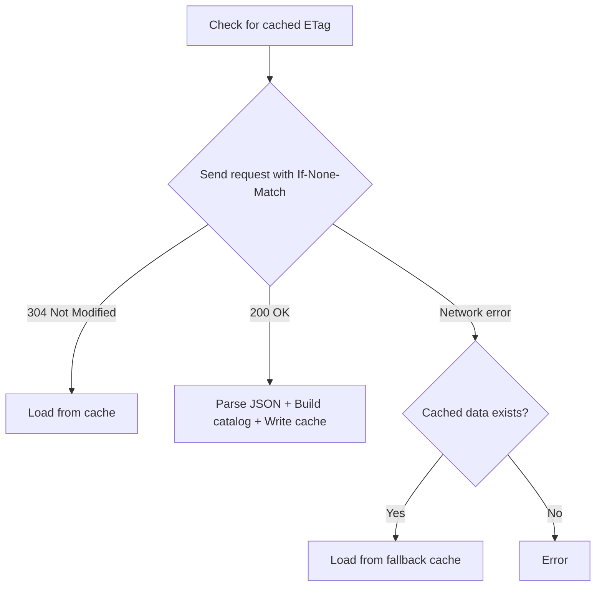

# Models Catalog

The `llm-coding-tools-models-dev` crate syncs the online
[models.dev](https://models.dev) catalog into a compact `ModelCatalog` that
can be used for provider/model lookups, validation, and display.

## Why this exists

If you run coding agents against many LLM providers, you need up-to-date
information about available models, their capabilities, and API endpoints.
[models.dev](https://models.dev) aggregates this data for 75+ providers.

This crate downloads from [models.dev], keeps only the fields needed, and builds
a `ModelCatalog` optimized for fast lookups.

## Load flow



1. Read cache header and get the old ETag (if present)
2. Send request to [models.dev] with `If-None-Match` when ETag exists
3. If `304 Not Modified`, load catalog from cache
4. If `200 OK`, parse JSON, build catalog, write fresh cache
5. If network fails, try cached data as fallback

## Usage

### Async ([tokio], default)

```rust
use llm_coding_tools_models_dev::{CatalogLoadSource, ModelsDevCatalog};

async fn load() -> Result<(), Box<dyn std::error::Error>> {
    let result = ModelsDevCatalog::load().await?;

    match result.source {
        CatalogLoadSource::Downloaded => println!("Downloaded fresh catalog"),
        CatalogLoadSource::NotModifiedCache => println!("Cache is up to date"),
        CatalogLoadSource::FallbackCache => println!("Using cached data (offline)"),
    }

    if let Some((provider, model)) = result.catalog.lookup("openai", "gpt-4") {
        println!("API URL: {}", provider.api_url);
        println!("Max input tokens: {}", model.max_input);
    }

    Ok(())
}
```

### Blocking

```rust
use llm_coding_tools_models_dev::{CatalogLoadSource, ModelsDevCatalog};

fn load() -> Result<(), Box<dyn std::error::Error>> {
    let result = ModelsDevCatalog::load()?;
    // Same interface as async, but synchronous
    Ok(())
}
```

### Custom cache path

```rust
use llm_coding_tools_models_dev::ModelsDevCatalog;
use std::path::PathBuf;

let cache_path = PathBuf::from("/tmp/my-cache");
let result = ModelsDevCatalog::load_at(&cache_path).await?;
```

## Cache details

**Location** (platform default):

| Platform | Path                                                            |
| -------- | --------------------------------------------------------------- |
| Linux    | `~/.cache/llm-coding-tools/models.dev.catalog.v1.cache`         |
| macOS    | `~/Library/Caches/llm-coding-tools/models.dev.catalog.v1.cache` |
| Windows  | `%LOCALAPPDATA%\llm-coding-tools\models.dev.catalog.v1.cache`   |

Override with the `LLM_CODING_TOOLS_MODELS_DEV_CACHE_PATH` environment variable.

**Performance** (rough guidance, Ryzen 9950X3D):

| Metric                                               | Value                       |
| ---------------------------------------------------- | --------------------------- |
| Raw JSON                                             | ~1.31 MiB                   |
| Serialized payload                                   | ~109 KiB                    |
| Compressed cache                                     | ~23.7 KiB ([zstd] level 17) |
| Compression time                                     | ~10.1 ms                    |
| Decompression time                                   | ~57 us                      |
| Full cache load (read + decompress + decode + build) | ~0.31 ms                    |

The catalog contains ~3000 models across 75+ providers, stored in a compact
hash-table format (~30 KiB in memory).

## Feature flags

| Flag       | Default | Description                 |
| ---------- | ------- | --------------------------- |
| `tokio`    | yes     | Async runtime support       |
| `blocking` | no      | Synchronous runtime support |

Exactly one must be enabled.

[models.dev]: https://models.dev
[tokio]: https://tokio.rs
[zstd]: https://facebook.github.io/zstd/
